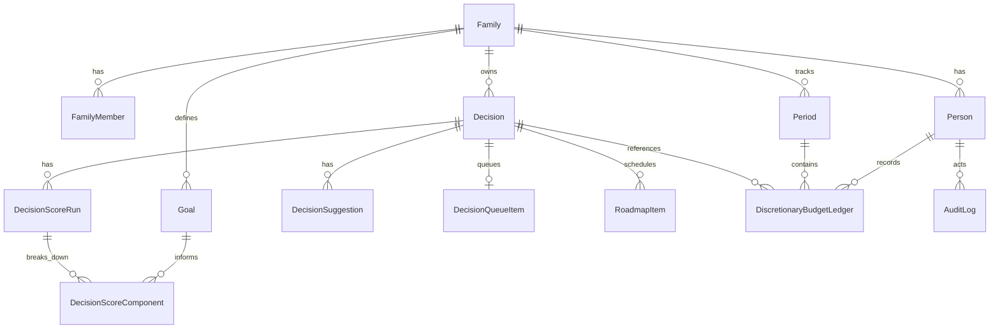

# Data Model and Indexing Plan

## ERD (Mermaid)

## Core Fields
- `Family`: id, name, created_at
- `FamilyMember`: id, family_id, email, display_name, role
- `Person`: person_id, family_id, display_name, role, legacy_member_id
- `Goal`: id, family_id, scope_type, owner_person_id, visibility_scope, name, description, action_types_json, weight, status, priority, horizon, target_date, success_criteria, review_cadence_days, next_review_at, tags_json, external_refs_json, goal_revision, created_at, updated_at, deleted_at
- `Decision`: id, family_id, scope_type, created_by_person_id, owner_person_id, target_person_id, visibility_scope, goal_policy, title, description, category, desired_outcome, cost, urgency, target_date, next_review_at, confidence_1_to_5, tags_json, constraints_json, options_json, notes, attachments_json, links_json, context_snapshot_json, status, version, created_at, updated_at, completed_at, deleted_at
- `DecisionScoreRun`: id, decision_id, version, computed_by, threshold_1_to_5, weighted_total_1_to_5, weighted_total_0_to_100, family_weighted_total_1_to_5, person_weighted_total_1_to_5, goal_policy, score_outcome, context_snapshot_json, created_at
- `DecisionScoreComponent`: score_run_id, goal_id, goal_name, goal_scope_type, goal_owner_person_id, goal_weight, goal_revision, score_1_to_5, rationale
- `DecisionSuggestion`: decision_id, suggested_change, expected_score_impact, rationale
- `DecisionQueueItem`: decision_id, priority, due_date, rank
- `RoadmapItem`: decision_id, bucket, start_date, end_date, status, dependencies_json
- `DiscretionaryBudgetLedger`: person_id, period_id, delta, reason, decision_id, created_at
- `Period`: family_id, start_date, end_date, type
- `AuditLog`: actor_person_id, entity_type, entity_id, action, changes_json, created_at

## Indexes
- `goals(family_id, scope_type, status)`
- `goals(family_id, owner_person_id, status)`
- `decisions(family_id, scope_type, status)`
- `decisions(family_id, owner_person_id, status)`
- `decisions(family_id, target_person_id, status)`
- `decision_score_runs(decision_id, created_at)`
- `decision_score_components(score_run_id, goal_id)`
- `discretionary_budget_ledger(person_id, period_id)`
- `audit_logs(entity_type, entity_id)`
- Recommended extras: `roadmap_items(status, start_date)`, `decision_queue_items(rank)`
